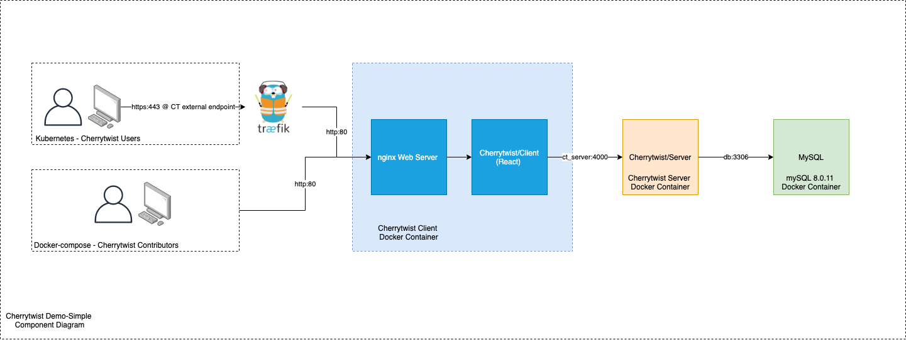

# Demo.Simple
A simple demo to create a running instance of Cherrytwist and populate it with some data. 

The core pieces of the demo are:
- **Server**: The core Cherrytwist server that maintains the Ecoverse, and that exposes a GraphQL based api
- **Client.Web**: Web front end that interfaces with the Cherrytwist server

Once the Server is up and running, this demo then loads some sample data via calls to GraphQL. 

The user can then intereact in two ways with the demo:
- Directly to the web interface
- Browse the GraphQL schema and make queries / mutations to the data

## Setup instructions

Prerequisites: 
- Docker and docker-compose installed on x86 architecture (so not an ARM-based architecture like Raspberry pi)
- ports 80, 4000 and 9000 free on localhost

The following commands are used to run this project:
- `docker-compose up -d` (to pull the images and start the containers in detached mode)
- `docker exec ct_server npm run test-db-reset` (to populate the database with some sample data)

Now both client and server are exposed locally and can be accessed, e.g. through a browser:
- server: http://localhost:4000/graphql
- client: http://localhost

>> Note: the demo does not use tls

Bonus: the docker-compose scripts also installs Portainer, which can be accessed from http://localhost:9000 to check the status of the demo.
- first install: 
  - choose password
  - choose local endpoint

