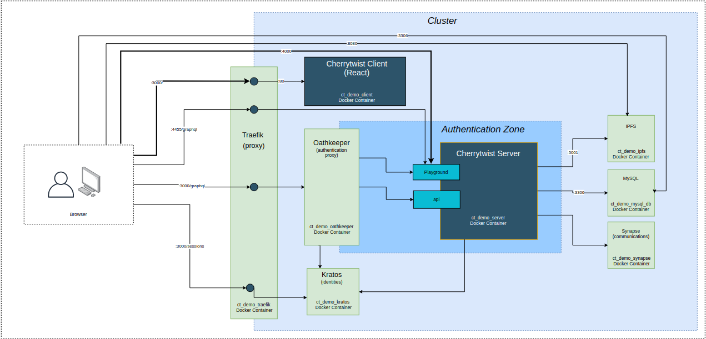

<p align="center">
  <a href="http://alkem.io/" target="blank"></a>
</p>
<p align="center"><i>Enabling society to collaborate. Building a better future, together.</i></p>


# Demo

This repository helps get a simple demonstrator instance of Alkemio running, and populated.

The core pieces of the demo are:

- **[Server](http://github.com/alkem-io/server)**: The core Alkemio server that maintains the Ecoverse, and that exposes a GraphQL based api
- **[Client-Web](http://github.com/alkem-io/client-web)**: Web front end that interfaces with the Alkemio Server
- **Oathkeeper, Kratos**: Provide authentication and identity management services that are used by the server
- **Traefik**: Used to create a single overview of all routes into the cluster
- **Other**: services such as mysql, ipfs, synapse (matrix) that are used to provide the server functionality

<p >

</p>

### Interaction
As shown by the bold arrows on the above diagram, you can then intereact in two primary ways with the demo:
* **Alkemio Web Client**: open a local browser and navigate to [http://localhost:3000](http://localhost:3000). This will direct you to the client so you can browse the contents of the platform.
* **Alkemio Server API**: open a local browser and navigate to [http://localhost:3000/graphql](http://localhost:3000/graphql), where you can interact directly with the data representing the Challenges via direct access to the graphql api on the server.

## Software Setup

Prerequisites:

- Docker, docker-compose, [nodejs](https://nodejs.org/en/download/package-manager/) and git installed on x86 architecture (so not an ARM-based architecture like Raspberry pi)
- Ports 3000, 3306 free on localhost
- Demo repository cloned to local device (`git clone https://github.com/alkem-io/Demo.git`)

The following commands are used to run this project:


* **Bootstrap configuration**: Execute `sudo .scripts/bootstrap.sh`.
* **Create the cluster**: Execute `docker-compose --env-file .env.docker up --build --force-recreate`
  * This creates the docker cluster with the containers connected to each other.
* **Verify the server is running**: Open a browser and navigate to [http://localhost:3000/graphql](http://localhost:3000/graphql)

Note: the first time the cluster starts up it has some installations to make, so it may take up to 5 minutes before the Alkemio Server is running. To monitor how the containers are starting up either use a tool like Docker Desktop (windows) or Portainer (any operating system).

At this point you hopefully will have a running empty ecoverse! Both client and server are exposed locally and can be accessed as [per description](#Interaction) above.

Once the cluster is setup, the next step is to load data into the Alkemio Server:
* **Setup environment variables**: Copy the `.env.docker` file to be `.env` file
* **Install package dependencies**: From the command line execute the following command to install all required package dependencies: `npm install`
* **Populate with sample data**:
  * Register a user admin@alkem.io with password @lk3m10!. The user has global admin permissions and is required for the data population.
  * From the command line, execute the following commange to populate the server with data: `npm run sample-data`.
  * Note: this can take a couple of minutes, you will see the progress in the window where you executed the command.

At this point you hopefully have a populated Ecoverse, with Challenges / sample users visible.

## Authentication

For ease of getting started, the demo is setup with authentication **disabled**. To enable authentication set the `AUTH_ENABLED` environment variable to true in `.env.docker` and re-create the docker compose cluster as described above.

The default administrator login is admin@alkem.io. If you register using that email address you will be able to explore the adminstration capabilities of the platform.

## Interacting with the Alkemio api
If you are interested in seeing the data that is held within the Alkemio platform, then it is advisable to try out directly querying data from the GraphQL api.

For this, open a local browser and navigate to [http://localhost:3000/graphql](http://localhost:3000/graphql).

A simple graphql query to try out is:
```
query {
  ecoverses {
    name,
    context {
     tagline
    }
    challenges {
      name
    }
  }
}
```

Full details of the api can be found on the docs and schema tabs on the right hand side:
<p >

</p>


## Custom Data
The sample data that is loaded is from the ```alkemio-sample-sdgs.ods``` file in this repository. This is a spreadsheet, that can be opened in Excel or compatible tools.

To modify the data and see how Alkemio could be used for hosting your Challenges, you can get a first impression by modifying this file.

Note: the file to be loaded is specfied by the *ALKEMIO_DATA_TEMPLATE* environment variable. This is set in the ```.env``` that you created above, so you can also specify a different file name by editing this environment variable.

For experimenting with custom data, it is usefult to be aware that it is also possible to revert the server back to a default empty ecoverse using the [Data Management page](http://localhost:3000/data-management).

